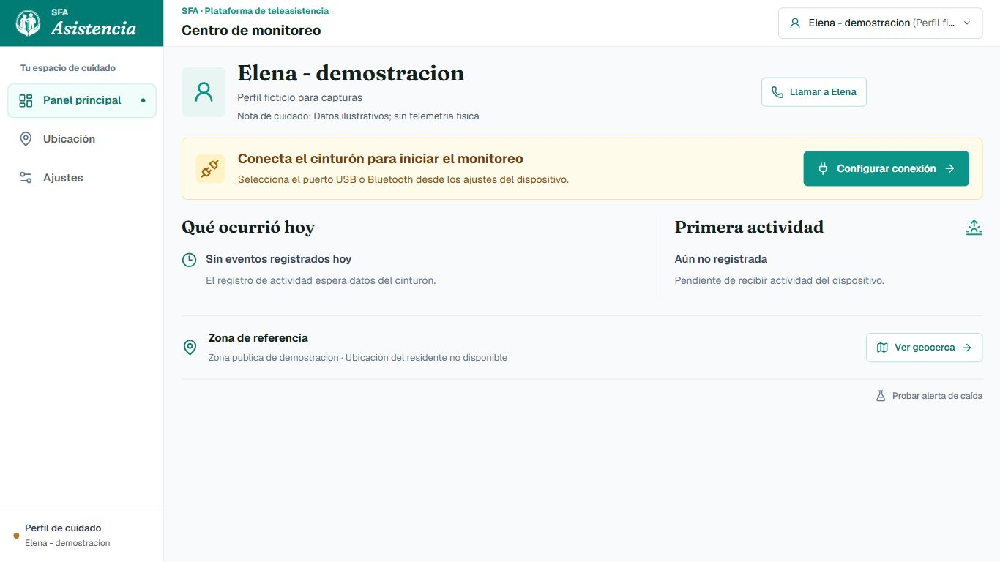
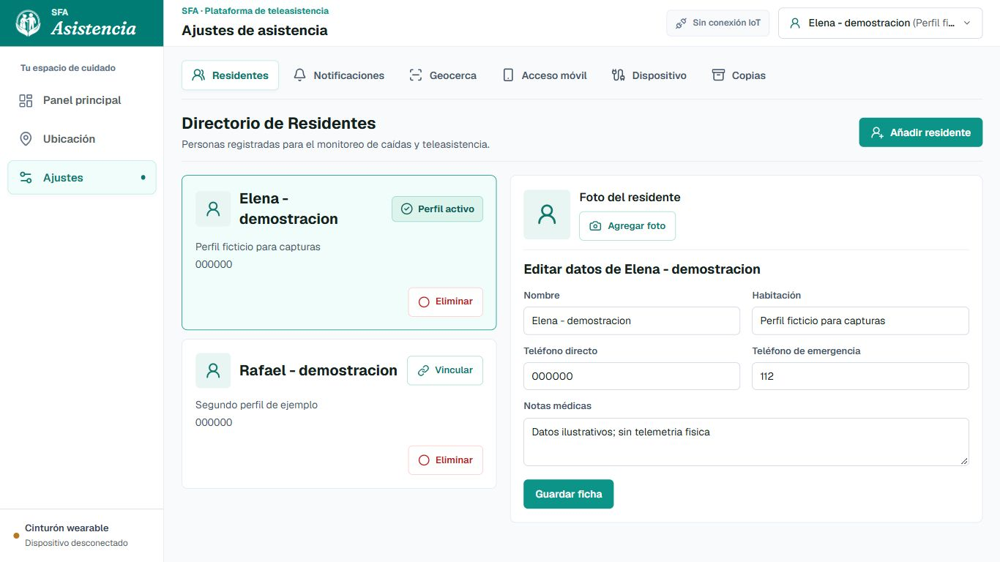
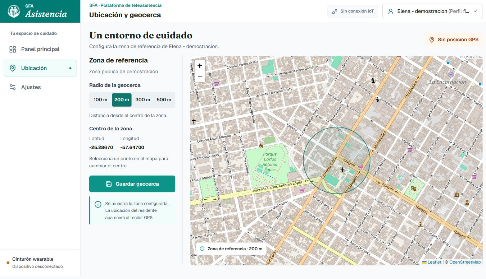

# SFA Asistencia

Sistema educativo de alerta anticaídas: cinturón Arduino con MPU6050 y panel local para cuidadores y familiares.

## Versión 1.1.0

Portable preparado para Windows de 64 bits. El release 1.1.0 está en borrador para revisión; las versiones públicas se consultan en [Releases](https://github.com/hfreedo/SFA-Asistencia-Anticaidas/releases).

No requiere instalar Python, Node.js ni dependencias del frontend. Incluye fuentes, iconos, generador QR y controlador opcional CH340/CH341.

## Funciones

- Monitoreo inercial por USB o Bluetooth serial, con estados de señal reciente y desconexión.
- Protocolo visual de caída, cronómetro y confirmación de atención.
- Perfiles con fotos, selección y edición sincronizada; feedback mediante toasts.
- Mapa de referencia y geocerca. No inventa posición si falta GPS.
- Preferencias de alertas y configuración de Telegram.
- Acceso móvil por Wi-Fi/hotspot con QR generado localmente.
- Exportación e importación de perfiles, fotos y preferencias.
- Interfaz adaptable a escritorio y celular.

Batería y GPS sólo aparecen cuando el dispositivo los informa; Arduino UNO/MPU6050 no los aporta por sí solo. El acceso web móvil no equivale a una APK ni a una cuenta vinculada.

## Capturas

Capturas del ejecutable preparado con perfiles ficticios y configuración aislada. Sin datos personales del usuario. La caída es una simulación de interfaz, no una prueba física del sensor.

[Galería completa de pantallas y opciones](docs/GALERIA.md): selector, registro, fotos, notificaciones, geocerca, QR, dispositivo, copias, toasts, emergencia y vista móvil.

## Inicio

1. Extraer todo el ZIP en una carpeta con permiso de escritura.
2. Ejecutar `ABRIR_SFA_ASISTENCIA.bat` o `SFA_Asistencia.exe`.
3. Registrar o importar residentes.
4. Elegir el puerto real de la placa en Ajustes > Dispositivo.

USB: 115200 baudios. HC-06: 9600 baudios. Cierra el Monitor Serie antes de conectar.

Para el celular, cierra el modo local y ejecuta `ABRIR_ACCESO_MOVIL.bat`. Conecta ambos equipos a la misma red de confianza y abre Ajustes > Acceso móvil. Este modo permite acceso al panel a equipos de esa red, sin autenticación de usuarios. No modifica el firewall automáticamente.

## Datos y Migración

Perfiles, fotos, eventos y ajustes permanecen en `data/sfa_eventos.sqlite3`, junto al ejecutable. El paquete no incluye tu base personal.

Ajustes > Copias exporta/importa perfiles, fotos y preferencias JSON. Omite historial y credenciales de Telegram. Para respaldar todo, cierra SFA y copia `data`. Conserva esas copias en un lugar privado.

## Compatibilidad

Destino: Windows 10/11 x64 con navegador moderno. Verificado localmente en Windows 11 x64 desde una extracción limpia, sin Python/Node en el PATH del proceso de prueba. Windows 10, una segunda PC física y Windows ARM no fueron probados. No es nativo para macOS, Linux ni Windows de 32 bits.

Fuentes e iconos son locales. El mapa necesita Internet para sus calles; Telegram requiere Internet y credenciales válidas. El driver es opcional y se instala manualmente sólo si la placa lo requiere.

Consulta [las pruebas y límites de compatibilidad](docs/VALIDACION.md) y [las versiones](RELEASES.md).

## Alcance y Distribución

Prototipo educativo y experimental. No es un dispositivo médico certificado ni sustituye supervisión humana o servicios de emergencia. La validación física, un teléfono real y el driver con placa conectada requieren pruebas adicionales.

Este repositorio publica presentación, documentación y capturas. No publica fuentes editables, firmware, bases de datos ni credenciales. Los ejecutables se distribuyen en Releases.

Las licencias de terceros siguen vigentes. El símbolo gráfico fue retocado a partir de una imagen aportada por el usuario; el retoque no sustituye los permisos del original.
