# Galería de SFA Asistencia 1.1.0

Capturas del portable con perfiles ficticios y configuración aislada. Sin Arduino conectado.

Panel principal

Residente, conexión y actividad.

Selector

Selección y acceso al registro.

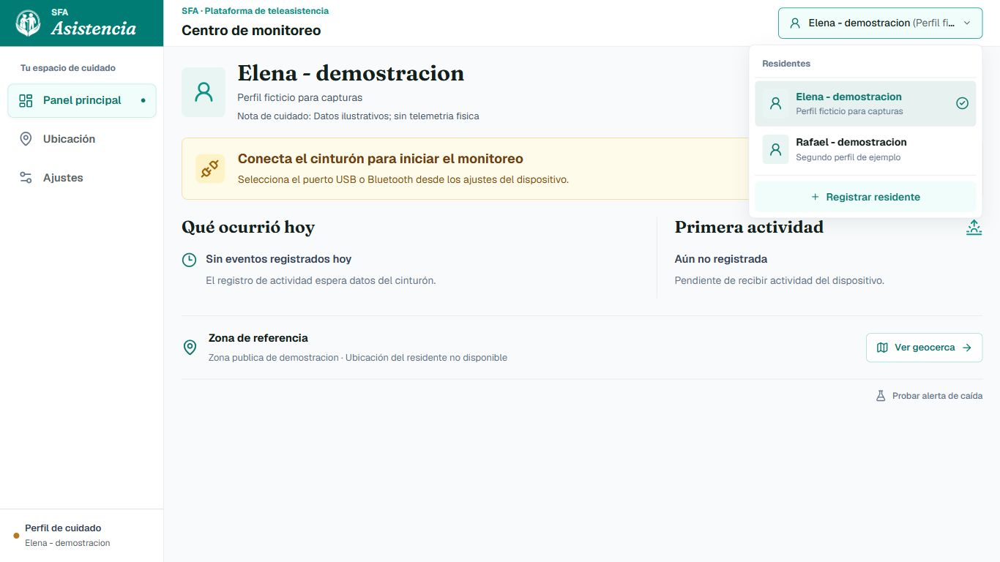

Ubicación

Zona pública de ejemplo, no GPS de una persona.

Residentes

Directorio, vinculación y edición.

Notificaciones

Interruptores y Telegram sin credenciales.

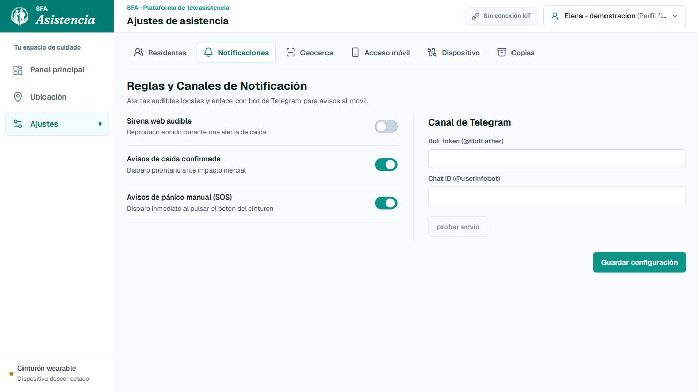

Parámetros de geocerca

Nombre, centro y radio.

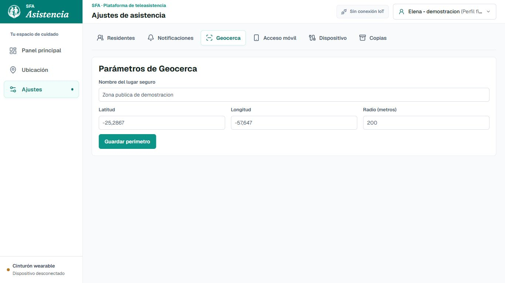

Acceso móvil

QR y ayuda de Wi-Fi/hotspot. Puerto de prueba 8878; puerto normal 8780.

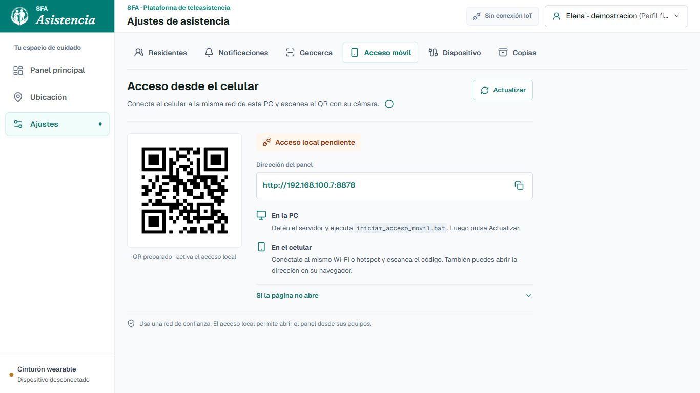

Dispositivo

Puertos de la PC de prueba; otra PC enumera sus propios COM.

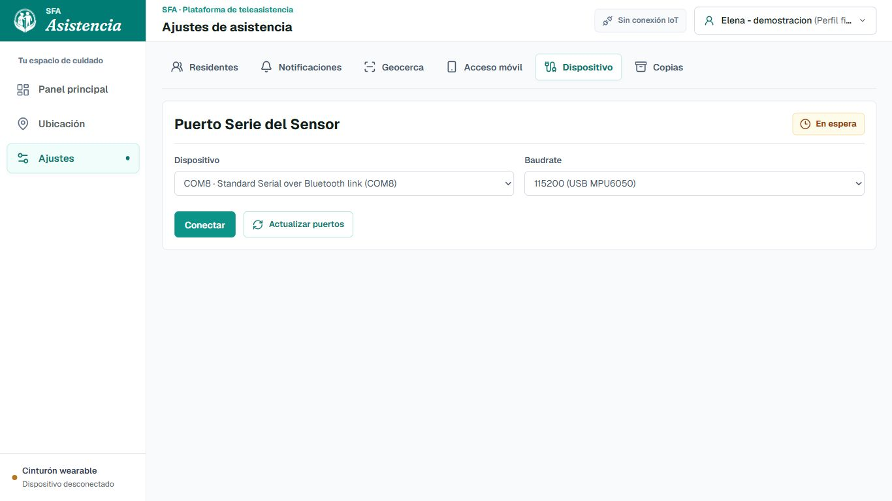

Copias

Exportación e importación.

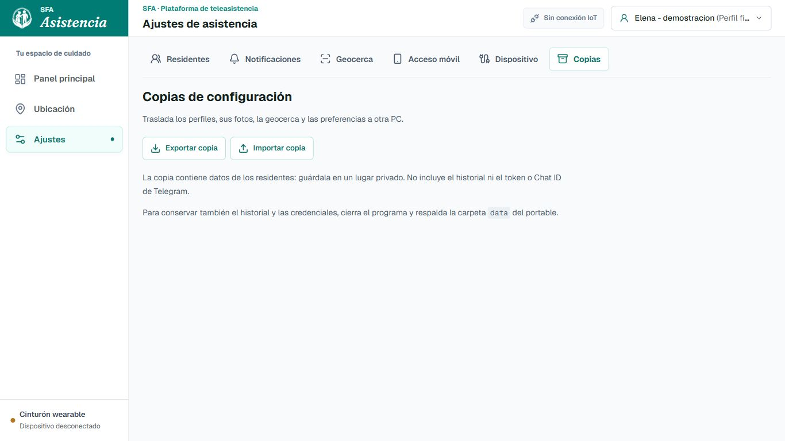

Registro

Modal de alta.

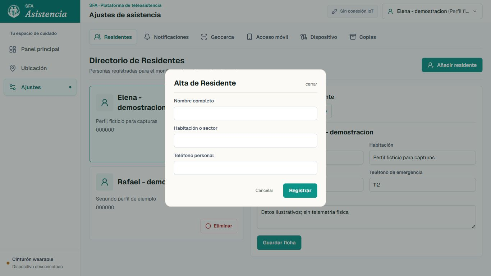

Toast

Confirmación y actualización de ficha.

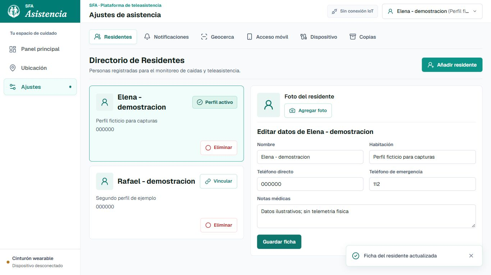

Caída simulada

Cronómetro vivo. No representa una prueba física.

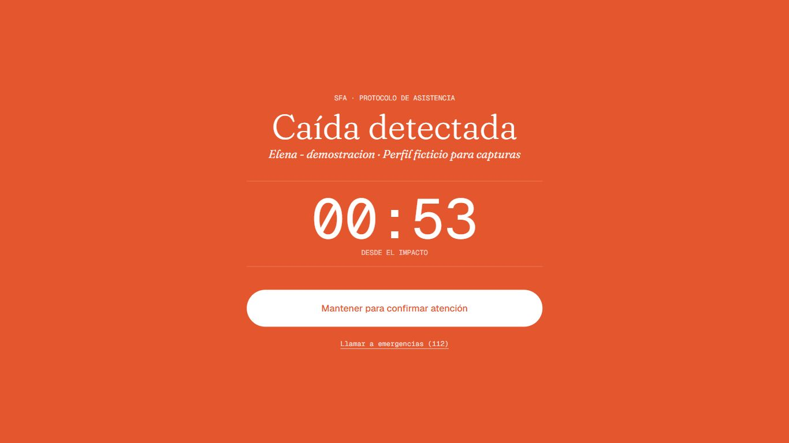

Vista móvil

Panel a 390 píxeles de ancho.

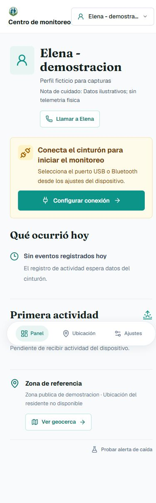

Fotos

Cambiar y quitar imagen. El símbolo del proyecto se usó como imagen ilustrativa, no como fotografía real.

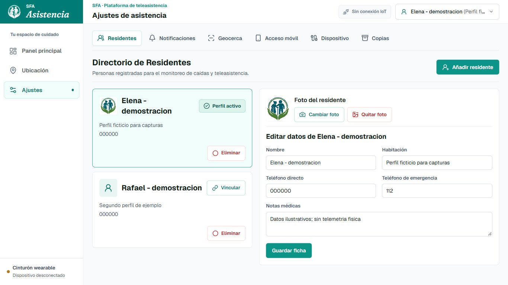

